# Enterprise Platform Engineering

Production-grade Platform Engineering stack implementing GitOps, observability, security policies, progressive delivery, and incident-ready operations on Kubernetes.
Enterprise Multi-Cluster Kubernetes Platform

<p align="center">


</p>

<p align="center">


</p>

# Enterprise Platform Engineering on Amazon EKS

Production-grade multi-cluster Kubernetes platform implementing:

• GitOps (ArgoCD)
• Progressive Delivery (Argo Rollouts)
• Infrastructure as Code (Terraform)
• Observability (Prometheus, Grafana, Loki, Tempo)
• Runtime Security (Falco)
• Policy Enforcement (Kyverno)
• Multi-Region Disaster Recovery
• Enterprise CI/CD

This platform implements a production-grade multi-cluster Kubernetes architecture on Amazon EKS using Infrastructure as Code, GitOps, centralized observability, policy-driven security, and progressive delivery.

The platform consists of a dedicated Platform Cluster that manages the Kubernetes platform and multiple environment clusters responsible for running application workloads across development, staging, production, and disaster recovery environments.

                   Developers
                        │
                 GitHub Repository
                        │
                GitHub Actions CI
                        │
        Terraform + Kubernetes Manifests
                        │
                ArgoCD (Platform Cluster)
                        │
      ┌─────────────────┼──────────────────┐
      │                 │                  │
     Dev             Stage              Production
      │                 │                  │
      └─────────────────┼──────────────────┘
                        │
                  Disaster Recovery
                 (Another AWS Region)

──────────────────────────────────────────────

Platform Cluster

• Prometheus
• Grafana
• Loki
• Tempo
• Alertmanager
• Argo Rollouts
• Kyverno
• Falco
• External Secrets
• cert-manager

──────────────────────────────────────────────

Applications

Frontend
API
Auth
Database

──────────────────────────────────────────────

Observability

Metrics → Prometheus
Logs → Loki
Traces → Tempo
Dashboards → Grafana
Alerts → Slack


Amazon EKS Clusters

Terraform provisions independent Amazon EKS clusters for platform management, application environments, and disaster recovery. Each cluster has a dedicated responsibility within the platform while remaining centrally managed through GitOps.

Cluster	Purpose
Platform	GitOps, Monitoring, Logging, Tracing and Alerting
Development	Feature development and testing
Staging	Pre-production validation
Production	Live production workloads
Disaster Recovery	Multi-region production replica
Screenshot
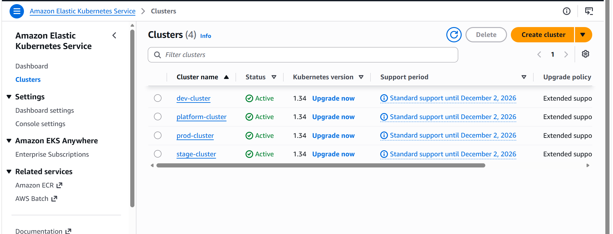

Multi-Cluster Environment Verification

The platform provisions multiple Amazon EKS clusters using Terraform to separate platform management, application workloads, and disaster recovery. Each cluster is independently managed while remaining part of the same GitOps platform.

Cluster Distribution
Cluster	Region	Purpose
Platform Cluster	ap-south-1	Centralized Platform Management
Dev Cluster	ap-south-1	Development Environment
Stage Cluster	ap-south-1	Pre-Production Validation
Prod Cluster	ap-south-1	Production Workloads
DR Cluster	ap-southeast-1	Multi-Region Disaster Recovery
Amazon EKS Cluster Verification

The AWS CLI confirms that all production environment clusters have been successfully provisioned in the primary region, while the Disaster Recovery cluster is deployed in a separate AWS Region for business continuity.

aws eks list-clusters --region ap-south-1

aws eks list-clusters --region ap-southeast-1
Kubernetes Context Management

The local kubeconfig is configured with contexts for every Kubernetes cluster, allowing administrators and GitOps tooling to securely manage multiple environments from a single control plane.

kubectl config get-contexts
Screenshot
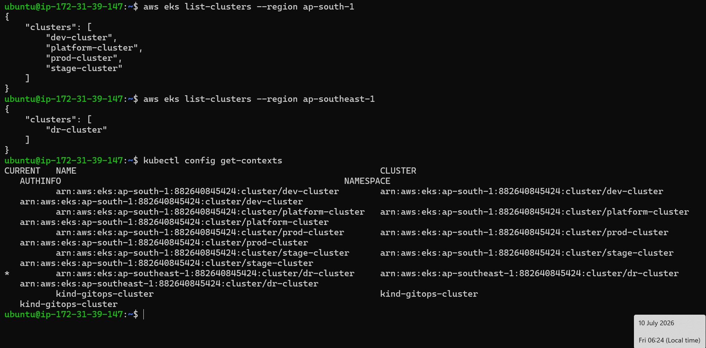

Multi-Cluster Verification

Verification of Platform, Development, Staging, Production, and Disaster Recovery Amazon EKS clusters using the AWS CLI and Kubernetes contexts. The screenshot confirms successful provisioning across multiple AWS Regions and demonstrates centralized management of all Kubernetes clusters through a unified kubeconfig.


Multi-Cluster Verification

Verification of Platform, Development, Staging, Production, and Disaster Recovery Amazon EKS clusters using the AWS CLI and Kubernetes contexts. The screenshot confirms successful provisioning across multiple AWS Regions and demonstrates centralized management of all Kubernetes clusters through a unified kubeconfig.

Disaster Recovery Cluster

The Disaster Recovery (DR) cluster is deployed in a separate AWS Region to provide regional resilience and business continuity. It mirrors the production environment and can be used to restore application services during a regional outage.

Key Features

Separate AWS Region deployment
Production environment replica
Business continuity
Multi-region disaster recovery
Independent Kubernetes control plane
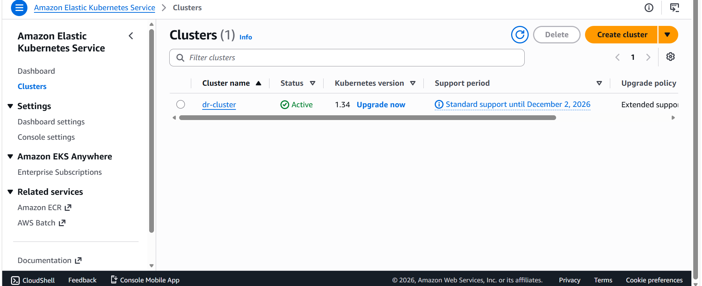

Amazon EKS console showing the Disaster Recovery cluster deployed in a separate AWS Region.

# Automation Scripts

The platform is fully automated using Bash scripts that bootstrap the Platform Cluster and Workload Clusters independently. Scripts are organized by responsibility to support a production-grade multi-cluster Kubernetes architecture.

---

## 🎥 Complete Platform Deployment Walkthrough

Click the preview below to watch the full installation on platform and workload clusters:

[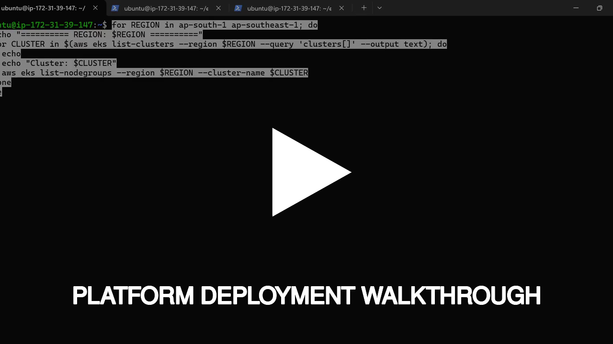](docs/demo-videos/platform-bootstrap-demo.mp4)

## Script Organization

| Directory | Purpose |
|-----------|---------|
| `scripts/platform-scripts/` | Installs and configures the Platform Cluster (ArgoCD, Prometheus, Grafana, Loki, Tempo, OpenTelemetry). |
| `scripts/workload-scripts/` | Bootstraps Dev, Stage, Prod and Disaster Recovery clusters with workload-specific platform components. |
| `scripts/kind-scripts/` | Legacy automation used for local Kind-based development and testing. |
| `scripts/cleanup.sh` | Cleans up local development resources. |

---

## Platform Cluster Bootstrap

Responsible for provisioning the centralized Platform Cluster.

| Script | Purpose |
|---------|---------|
| `bootstrap-platform.sh` | Bootstraps the complete Platform Cluster |
| `01-metrics-server.sh` | Installs Metrics Server |
| `02-argocd.sh` | Installs ArgoCD |
| `03-monitoring.sh` | Installs Prometheus, Grafana and Alertmanager |
| `04-loki.sh` | Installs Loki |
| `05-tempo.sh` | Installs Tempo |
| `06-opentelemetry.sh` | Installs the OpenTelemetry Collector |

---

## Workload Cluster Bootstrap

Responsible for provisioning Development, Staging, Production and Disaster Recovery clusters.

| Script | Purpose |
|---------|---------|
| `bootstrap-workload.sh` | Bootstraps the complete Workload Cluster |
| `01-nginx-ingress.sh` | Installs NGINX Ingress Controller |
| `02-cert-manager.sh` | Installs Cert Manager |
| `03-external-secrets.sh` | Installs External Secrets |
| `04-argo-rollouts.sh` | Installs Argo Rollouts |
| `05-opentelemetry-agent.sh` | Installs OpenTelemetry Agent |
| `06-kyverno.sh` | Installs Kyverno |
| `07-verify-workload.sh` | Verifies workload cluster readiness |

---

## Configuration Management

Helm values for every platform component are maintained separately under the `values/` directories, ensuring consistent, repeatable and environment-specific deployments across all Kubernetes clusters.


# Terraform Remote State Management

Before provisioning the Kubernetes platform, Terraform bootstraps a production-ready remote backend for infrastructure state management.

The backend consists of:

- Amazon S3 for centralized Terraform state storage
- DynamoDB for distributed state locking
- Bucket Versioning
- Server-side Encryption (AES-256)

This enables safe team collaboration by preventing concurrent Terraform operations and preserving infrastructure state history.

---

## Architecture

```text
Terraform
     │
     ▼
Bootstrap Infrastructure
     │
     ├────────────► Amazon S3
     │               Terraform State
     │
     └────────────► DynamoDB
                     State Lock
```

---

## Terraform Initialization

Terraform downloads providers and initializes the working directory.

```bash
cd infrastructure/terraform/bootstrap

terraform init
```

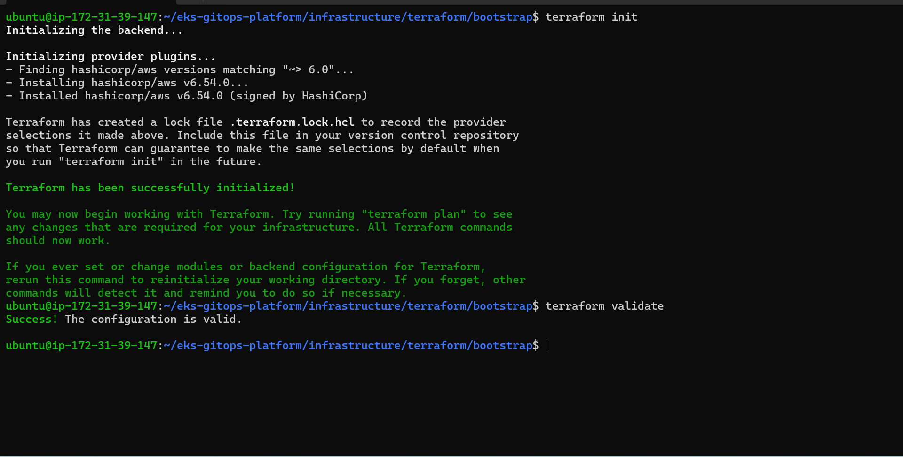

---

## Configuration Validation

Terraform validates the configuration before any infrastructure changes are applied.

```bash
terraform validate
```

## Execution Plan

Terraform generates an execution plan showing all resources that will be provisioned.

Resources created:

- Amazon S3 Bucket
- Bucket Versioning
- Server-side Encryption
- DynamoDB Lock Table

```bash
terraform plan
```

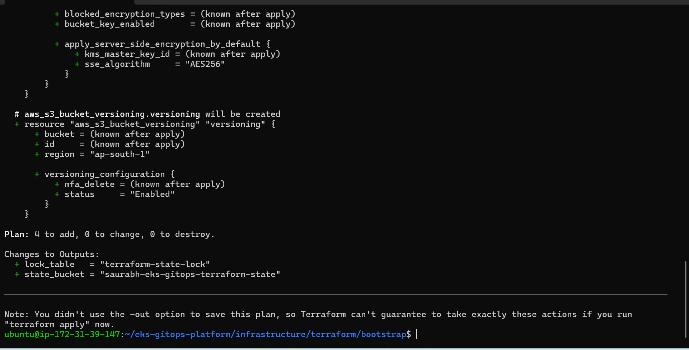

---

## Infrastructure Provisioning

Terraform provisions the backend resources.

```bash
terraform apply
```

Outputs

```
state_bucket = saurabh-eks-gitops-terraform-state

lock_table = terraform-state-lock
```

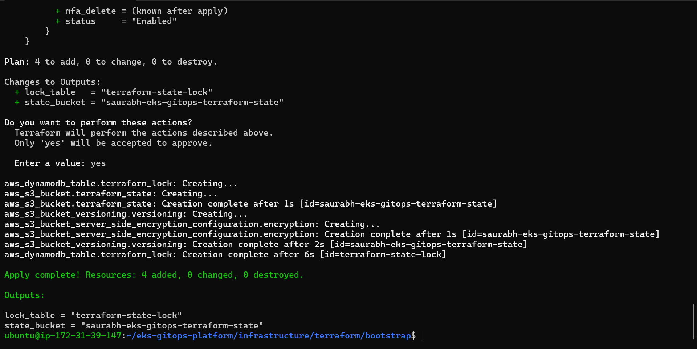

---

## Amazon S3 Remote State

Terraform state is stored in an encrypted and versioned Amazon S3 bucket.

Features

- Centralized remote state
- Bucket Versioning
- AES-256 Server-side Encryption
- Team collaboration
- Disaster recovery

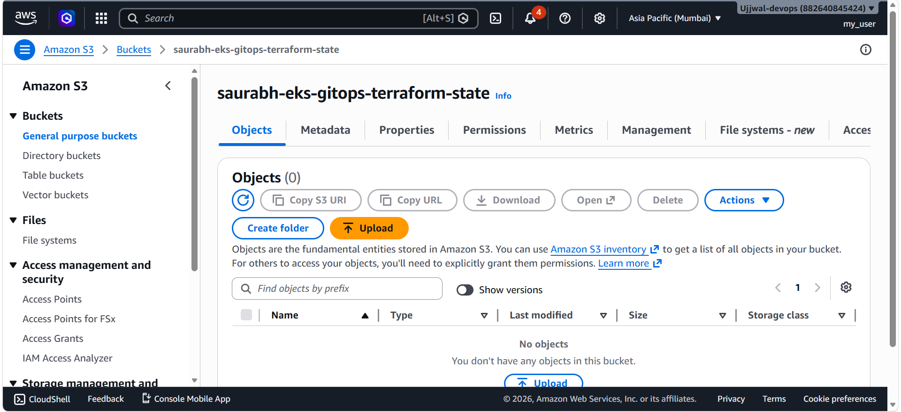

---

## DynamoDB State Locking

Terraform uses DynamoDB to ensure only one infrastructure operation modifies the state file at a time.

Benefits

- Prevents simultaneous `terraform apply`
- Eliminates state corruption
- Supports collaborative Infrastructure as Code workflows

Partition Key

```
LockID
```

Billing Mode

```
On-Demand
```

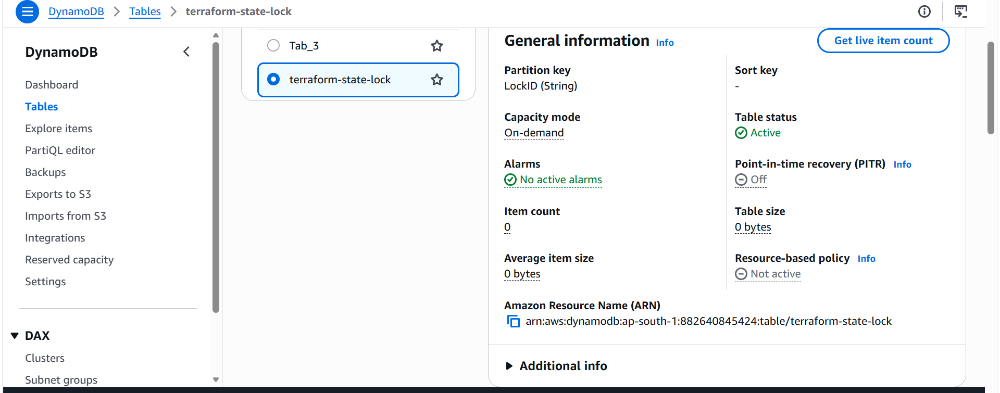

---
Terraform State Lock Management

Terraform uses remote state locking to prevent concurrent infrastructure modifications. During infrastructure planning, Terraform detected an existing remote state lock and safely blocked the operation.

The stale lock was removed after verifying that no other Terraform operation was running.

terraform force-unlock <LOCK_ID>
Benefits
Prevents concurrent Terraform operations
Protects remote state integrity
Supports safe team collaboration
Ensures production-grade Infrastructure as Code workflows

Screenshot

Terraform State Lock Management

Detection of a remote Terraform state lock and recovery using terraform force-unlock while managing the production EKS infrastructure.

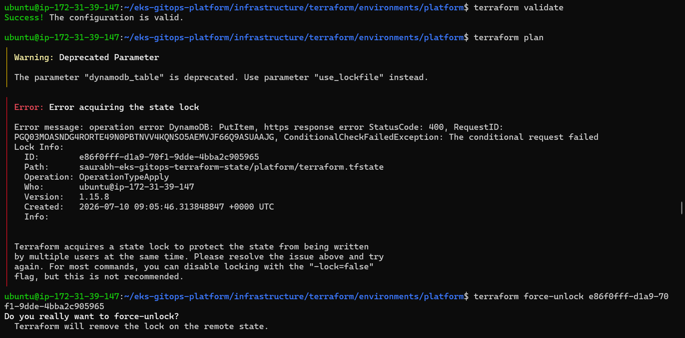

This concise version fits well between Amazon S3 Remote State and DynamoDB State Locking without interrupting the flow of your README.

## Production Benefits

- Remote Terraform state
- Distributed state locking
- Version history
- Server-side encryption
- Safe multi-user infrastructure provisioning
- Production-ready Infrastructure as Code workflow

# Enterprise Terraform Structure

The infrastructure code is organized using reusable Terraform modules and environment-specific configurations. This layout enables consistent provisioning of multiple Kubernetes clusters while keeping the infrastructure code modular and maintainable.

Repository Structure

```text
terraform/
├── bootstrap/
├── modules/
│   └── eks-cluster/
└── environments/
    ├── platform/
    ├── dev/
    ├── stage/
    ├── prod/
    └── disaster-recovery/
```

Benefits

- Reusable Terraform modules
- Environment-specific configuration
- Remote state management
- Scalable multi-cluster deployments
- Production-ready Infrastructure as Code

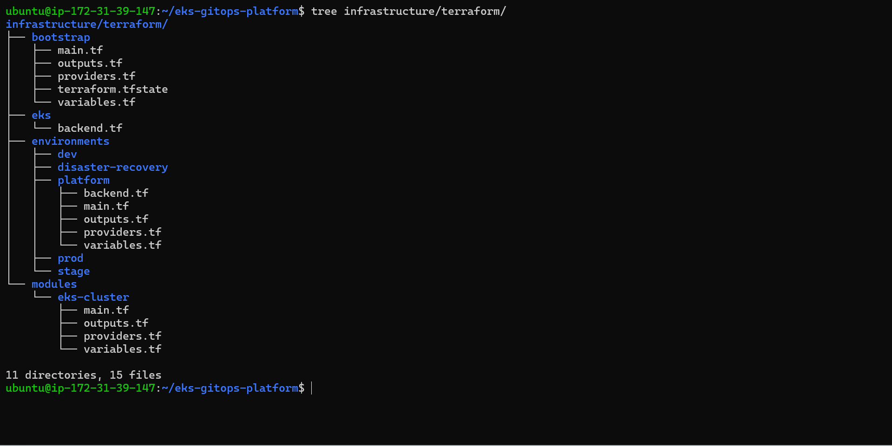

## Terraform Initialization

Terraform initializes the remote backend, downloads required providers and modules, and prepares the working directory for infrastructure provisioning.

```bash
terraform init
```


---
## Infrastructure Planning

Terraform generates an execution plan that previews the infrastructure before any resources are created. This allows changes to be reviewed safely before deployment.

```bash
terraform plan
```

The plan provisions:

- Amazon VPC
- Multi-AZ Networking
- Amazon EKS Cluster
- Managed Node Group
- Supporting AWS Resources


---
## Production EKS Cluster Provisioning

Terraform provisions a production-ready Amazon EKS cluster including:

- Managed Node Groups
- VPC
- NAT Gateway
- IAM Roles
- OIDC Provider
- VPC CNI
- CoreDNS
- kube-proxy
- EKS Pod Identity Agent
---

### Kind Cluster Verification


*Fresh Kubernetes cluster showing only core system components before platform bootstrap, ensuring a clean and reproducible GitOps setup.*

### ArgoCD Bootstrap


*Successfully deployed ArgoCD as the GitOps control plane. Verified that all core components—including the API server, application controller, repository server, Redis, Dex, notifications controller, and ApplicationSet controller—are running and healthy.*

### GitOps Application Deployment

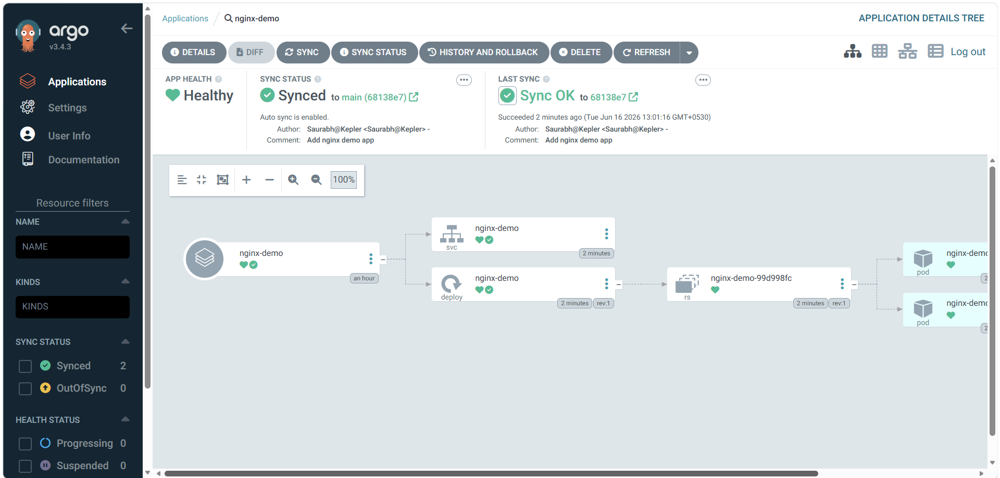

*Successfully deployed the nginx-demo application using ArgoCD GitOps. The application is synchronized with the Git repository and automatically reconciled to the desired state stored in version control.*

After checking nginx-demo is working smoothly all other apps auth ,api , database ,frontend has been deployed.

## 🎥 GitOps Live Deployment Demo

Click the thumbnail below to watch an end-to-end GitOps deployment from Git commit to production sync.

[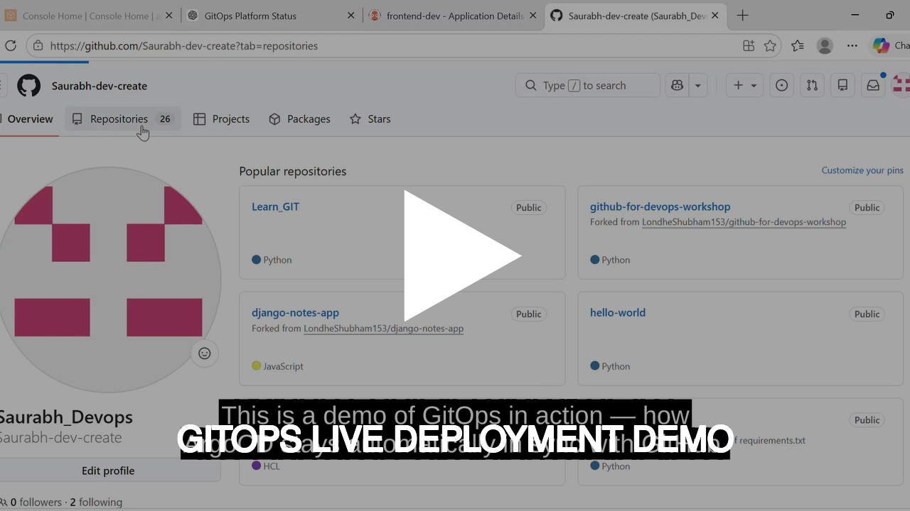](docs/demo-videos/gitops-live-deployment-demo.mp4)

**Key Features Demonstrated**

* Automated deployment through GitOps
* Continuous reconciliation of cluster state
* Self-healing and drift detection
* Declarative application management
* End-to-end Git-to-Kubernetes workflow

### Multi-Environment GitOps Deployment

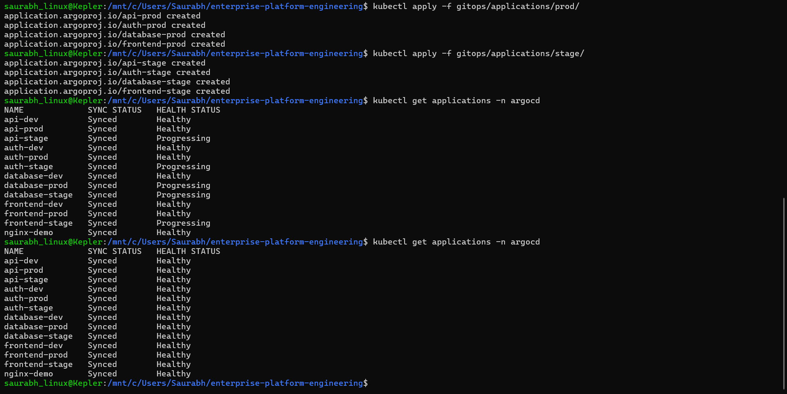

*ArgoCD managing development, staging, and production environments through GitOps. Frontend, API, Authentication, and Database services are deployed across isolated namespaces and continuously synchronized from Git repositories. This demonstrates environment segregation, automated deployment reconciliation, and production-style application lifecycle management using GitOps principles.*

## Prometheus Metrics Collection

### Prometheus Target Discovery & Health Verification

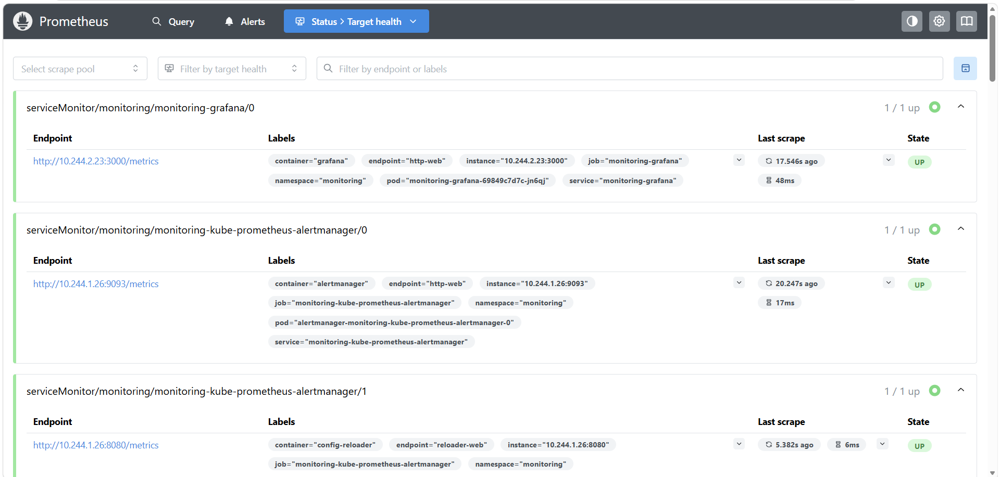

Prometheus successfully discovers and scrapes metrics from Kubernetes workloads through ServiceMonitor resources provided by the Prometheus Operator. The target health dashboard confirms successful metric collection from Grafana, Alertmanager, Prometheus components, and Kubernetes services, providing a reliable foundation for monitoring and alerting.

**Key Highlights**
- Automated target discovery using ServiceMonitors
- Continuous metrics collection from Kubernetes services
- Health verification of monitoring endpoints
- Production-grade monitoring foundation for platform operations

---

## Grafana Cluster Dashboard

### Kubernetes Resource Monitoring

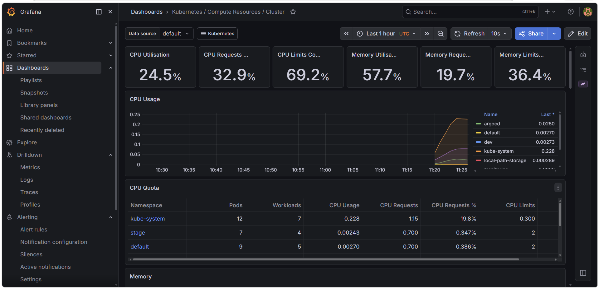

Grafana provides real-time visibility into cluster health, resource utilization, and workload performance across all environments. Metrics collected by Prometheus are visualized through dashboards that track CPU consumption, memory utilization, workload capacity, and namespace-level resource allocation.

**Monitored Environments**
- Dev
- Stage
- Production

**Observed Metrics**
- CPU Utilization
- CPU Requests & Limits
- Memory Utilization
- Memory Requests & Limits
- Namespace Resource Consumption
- Workload Health & Capacity

---

## Monitoring Architecture

```text
Applications
     │
     ▼
Prometheus Operator
     │
     ▼
Prometheus
     │
     ▼
Grafana
     │
     ▼
Dashboards & Alerts
```

The observability stack enables centralized monitoring, performance analysis, troubleshooting, and operational visibility across the GitOps-managed Kubernetes platform.

## Centralized Logging with Loki & Promtail

The platform implements centralized log aggregation using Grafana Loki and Promtail.

### Architecture

Application Pods
        ↓
Container Logs
        ↓
Promtail DaemonSet
        ↓
Loki
        ↓
Grafana Explore

### Features

- Cluster-wide log collection
- Kubernetes metadata enrichment
- Namespace-based filtering
- Application-level log search
- Centralized troubleshooting

### Example Investigation

Frontend application logs can be queried directly from Grafana Explore using Kubernetes labels.

Example query:

{namespace="dev", app="frontend"}

This allows operators to isolate logs for a specific application without accessing individual pods.

### Screenshot

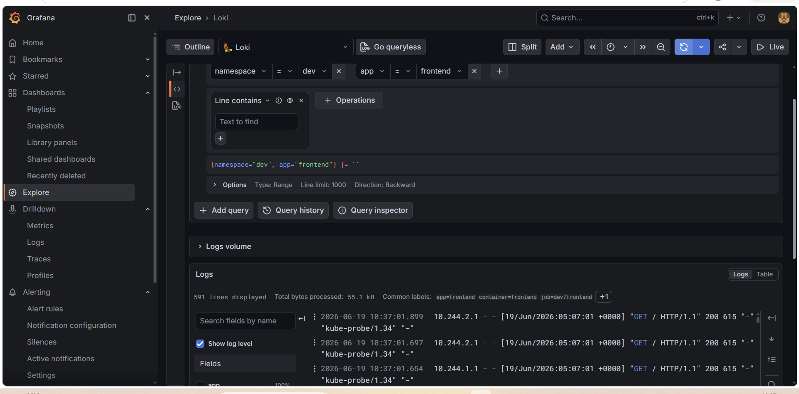

### Distributed Tracing with Tempo

OpenTelemetry Collector receives OTLP traces and forwards them to Tempo.
Grafana provides end-to-end trace visualization, span hierarchy analysis,
and latency investigation capabilities.

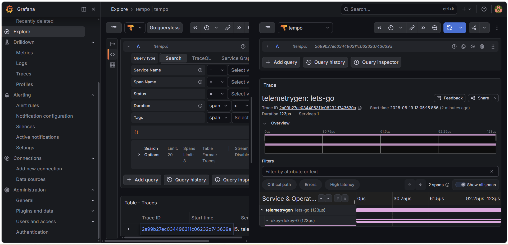

## Security & Governance with Kyverno

### Kyverno Deployment

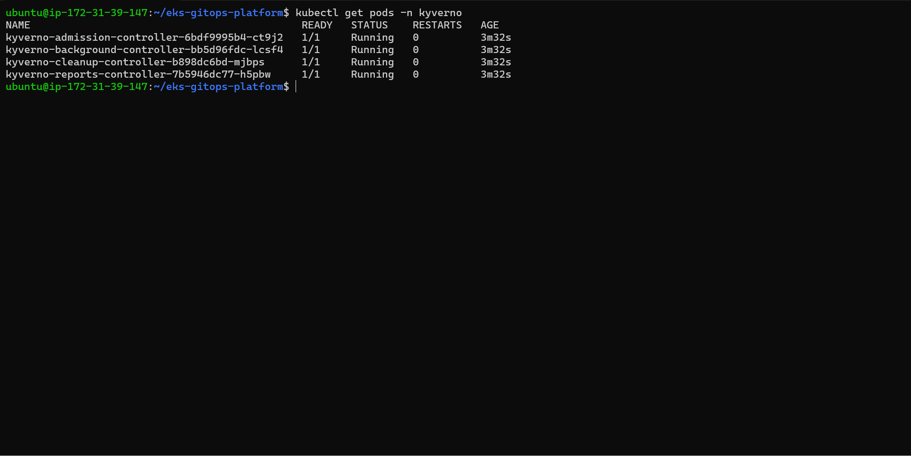

*Kyverno deployed as the Kubernetes policy engine, providing admission control, policy enforcement, compliance reporting, and governance capabilities across development, staging, and production environments.*

### Platform Governance Architecture

```text
Developer
    │
    ▼
Git Commit
    │
    ▼
ArgoCD
    │
    ▼
Kubernetes API Server
    │
    ▼
Kyverno Admission Controller
    │
    ├── Validate Policies
    ├── Enforce Security Rules
    ├── Generate Reports
    └── Audit Existing Resources
    │
    ▼
Cluster Resources
```

### Governance Capabilities

- Enforce organization-wide Kubernetes policies
- Prevent deployment of non-compliant workloads
- Validate resource requests and limits
- Enforce application labeling standards
- Restrict insecure container configurations
- Generate compliance and policy reports
- Apply governance consistently across Dev, Stage, and Prod environments

### Installed Components

| Component | Purpose |
|------------|----------|
| Admission Controller | Intercepts and validates Kubernetes resources |
| Background Controller | Continuously evaluates existing resources |
| Reports Controller | Generates policy compliance reports |
| Cleanup Controller | Handles automated resource cleanup tasks |

### Policy Enforcement: Resource Governance

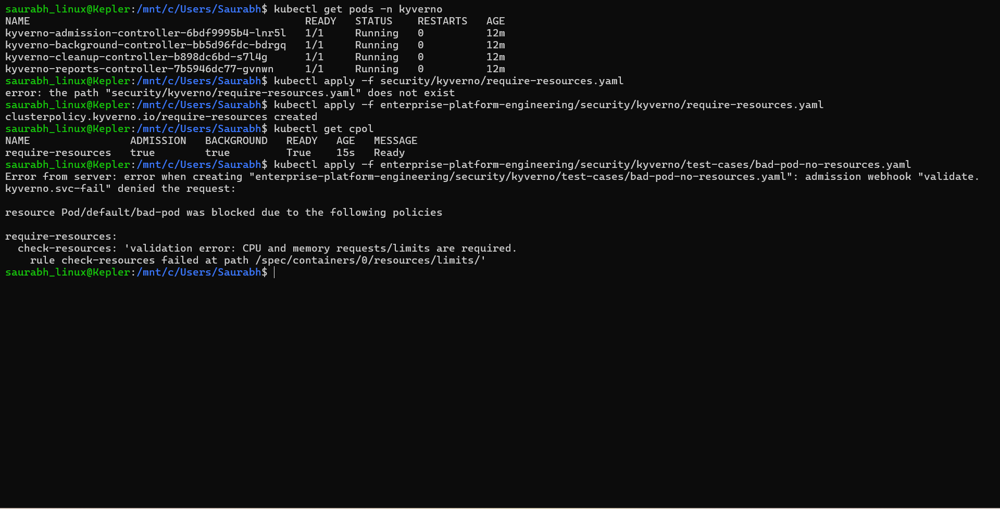

*Kyverno enforced platform governance by blocking deployment of a non-compliant workload that did not define CPU and memory requests/limits. This prevents uncontrolled resource consumption and ensures workloads adhere to operational standards before reaching the cluster.*

### Policy Enforcement: Non-Root Containers

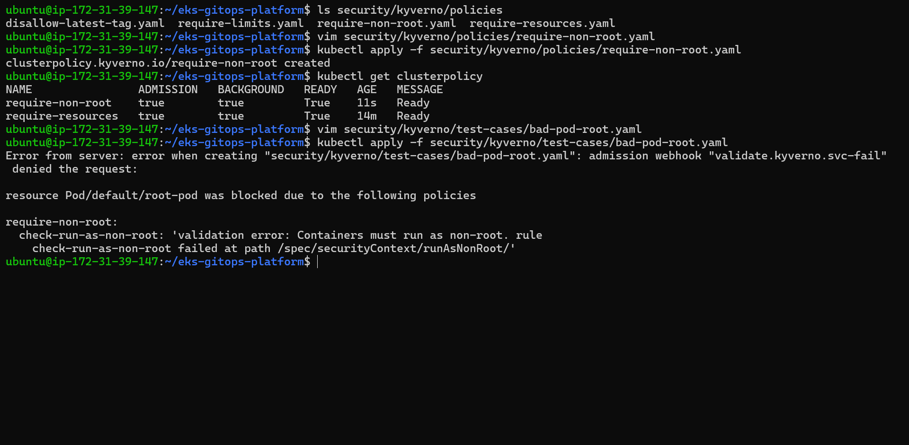

*Kyverno enforced the cluster security policy by rejecting a Pod that did not specify `runAsNonRoot: true`. Running containers as non-root reduces the risk of privilege escalation and follows Kubernetes security best practices by preventing workloads from executing with root privileges.*

### Policy Enforcement: Disallow Latest Image Tag

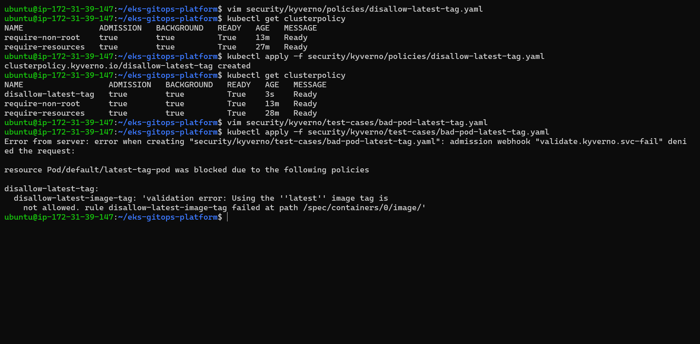

*Kyverno enforced deployment governance by rejecting a Pod that used the mutable `latest` image tag. Requiring explicit image versions ensures reproducible deployments, supports controlled application releases, and prevents unexpected behavior caused by automatic image updates.*

### Policy Enforcement: Required Labels

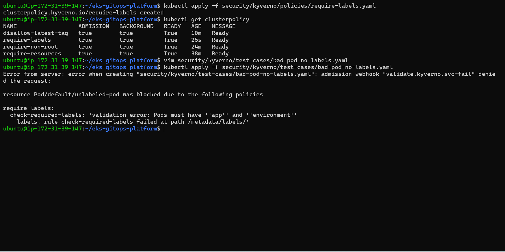

*Kyverno enforced organizational governance by rejecting a Pod that did not define the required `app` and `environment` labels. Standardized labels improve workload identification, enable reliable service discovery, support monitoring and GitOps workflows, and simplify operational management across Kubernetes environments.*

### Policy Enforcement: Require Liveness Probe

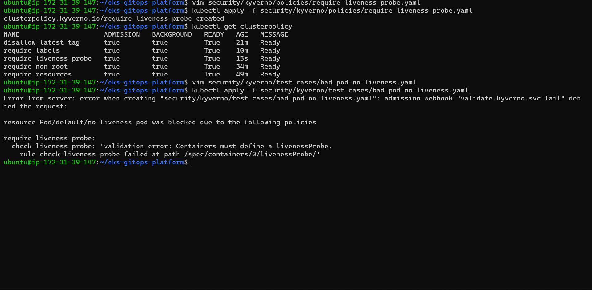

*Kyverno enforced workload health standards by rejecting a Pod that did not define a `livenessProbe`. Requiring liveness probes enables Kubernetes to detect unhealthy containers and automatically restart them, improving application reliability and reducing manual intervention.*

### Policy Enforcement: Require Readiness Probe

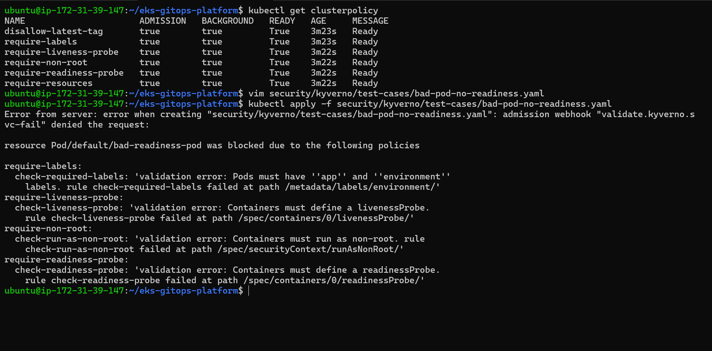

*Kyverno enforced workload readiness standards by rejecting a Pod that did not define a `readinessProbe`. Requiring readiness probes ensures that traffic is routed only to containers that are fully initialized and ready to serve requests, improving application availability and preventing requests from reaching unhealthy or unprepared workloads.*

## Progressive Delivery with Argo Rollouts Overview

To enable production-grade deployment strategies, this platform integrates Argo Rollouts for progressive delivery on Kubernetes.

Argo Rollouts extends the native Deployment resource and enables:

Blue-Green Deployments
Canary Deployments
Automated Rollbacks
Controlled Promotions
Safer Application Releases

This allows application updates to be validated before exposing them to production traffic, reducing deployment risk and minimizing downtime.

## 🎥 Blue-Green Deployment Demo

Click the thumbnail below to watch the complete GitOps-driven Blue-Green deployment.

[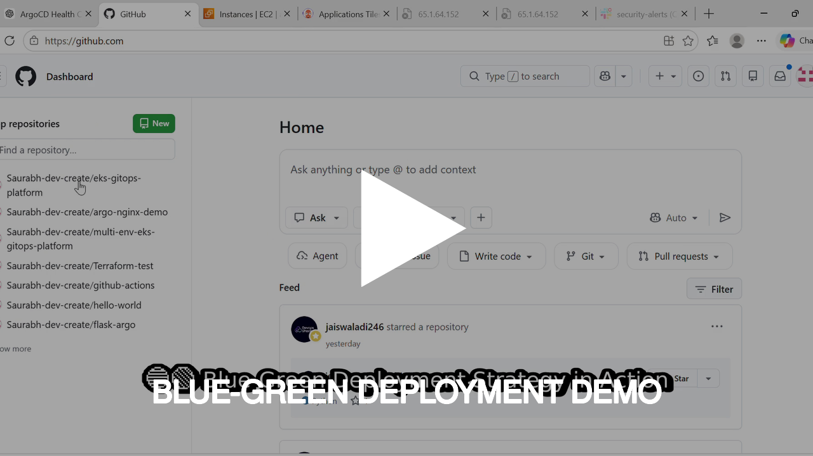](docs/demo-videos/blue-green-deployment-demo.mp4)
#### Demonstration Workflow

The video walks through the complete release lifecycle:

1. A new application version is committed to the Git repository.
2. ArgoCD automatically detects the updated Git revision and synchronizes the Kubernetes manifests.
3. Argo Rollouts creates a new **Preview ReplicaSet** while the existing application version continues serving production traffic.
4. The rollout enters a **paused** state, allowing validation of the new release before exposing it to users.
5. After verification, the rollout is manually promoted using the Argo Rollouts CLI.
6. Production traffic is switched from the **Active Service** to the newly validated ReplicaSet without downtime.
7. The previous ReplicaSet is automatically scaled down while remaining available for rollback during the transition.
8. Final verification confirms that all platform components and GitOps applications are synchronized and running successfully.

#### Production Capabilities Demonstrated

- GitOps-driven application deployment
- Automatic synchronization with ArgoCD
- Progressive delivery using Argo Rollouts
- Blue-Green deployment strategy
- Preview environment validation
- Manual approval before production release
- Zero-downtime traffic switching
- ReplicaSet-based rollout management
- Automated post-deployment verification
- Safe rollback-ready release process

This demonstration represents a production-style release workflow where application changes are continuously delivered through GitOps while maintaining deployment safety, operational visibility, and high application availability.
Blue-Green Deployment

A Blue-Green deployment strategy was implemented using Argo Rollouts.

Workflow
Existing application version serves production traffic.
New version is deployed to a preview environment.
Validation and testing are performed on the preview version.
Traffic is promoted to the new version after approval.
Previous version remains available for rollback if required.
Rollout Configuration
Active Service: frontend-active
Preview Service: frontend-preview
Replicas: 2
Auto Promotion: Disabled
Manual Promotion Enabled
Benefits
Zero downtime deployments
Instant rollback capability
Safe production releases
Reduced deployment risk
Deployment Verification

The rollout controller successfully created and managed a dedicated ReplicaSet for the new application version.

Verification Commands
kubectl get rollout

kubectl get rs

kubectl get pods

kubectl argo rollouts get rollout frontend-rollout
Example Output
NAME               DESIRED
frontend-rollout   2

ReplicaSet
frontend-rollout-7cb98c7

Pods
frontend-rollout-7cb98c7-5hlfl
frontend-rollout-7cb98c7-98jxr
Blue-Green Deployment Validation

The following screenshot demonstrates a successful Blue-Green deployment managed by Argo Rollouts.


Argo Rollouts Deployment Verification

Argo Rollouts successfully created a new ReplicaSet and managed application pods using a Blue-Green deployment strategy.

### Blue-Green Deployment with Argo Rollouts

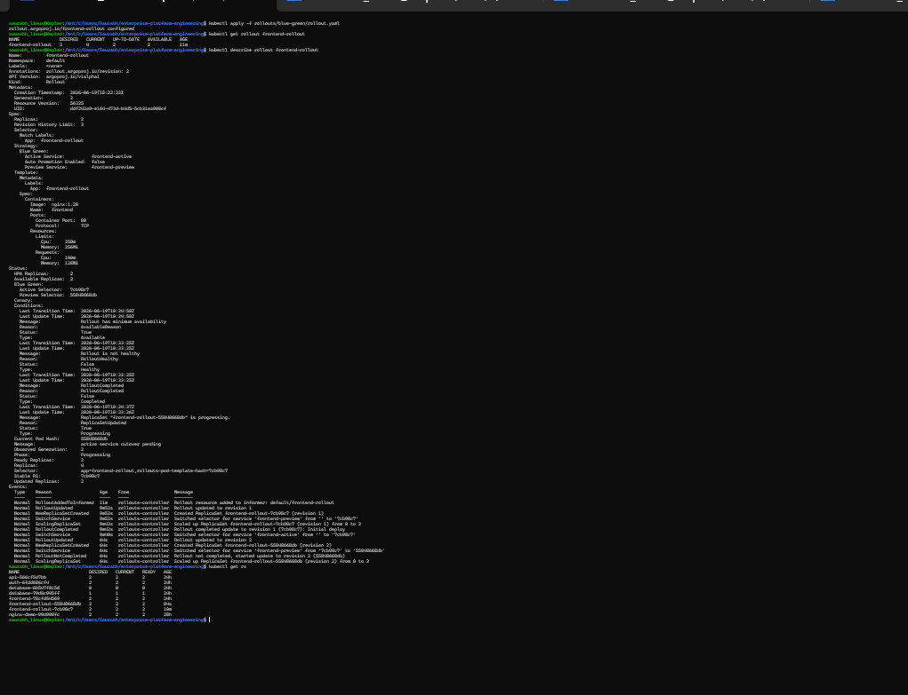

*Argo Rollouts deployed a new application version (nginx:1.28) to the preview environment while production traffic continued serving the stable version (nginx:1.27). The rollout entered a paused state with manual promotion enabled, demonstrating a production-grade Blue-Green deployment workflow where new releases can be validated before traffic cutover. Separate active and preview services ensure zero-downtime deployments and safe release validation.*

### Blue-Green Promotion Using Argo Rollouts

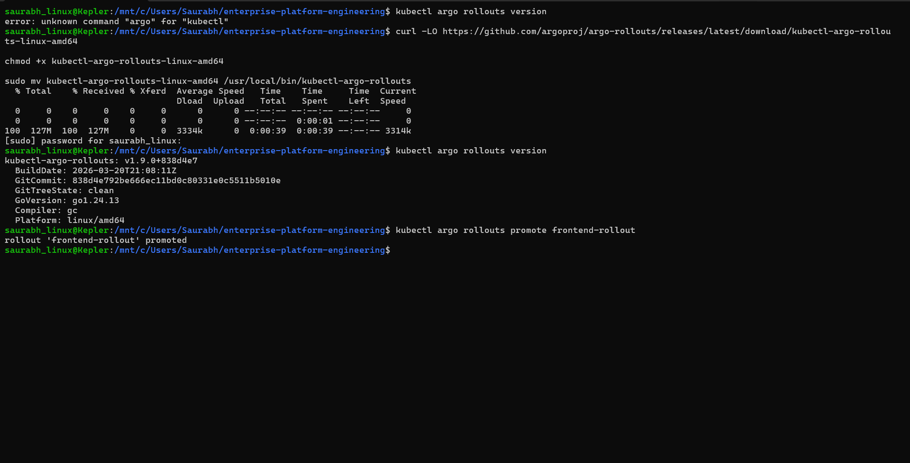

*Installed the Argo Rollouts CLI plugin and manually promoted a pending Blue-Green deployment. The rollout promotion switched production traffic from the stable ReplicaSet to the validated preview ReplicaSet, demonstrating controlled release management and zero-downtime deployment practices.*

### Blue-Green Deployment Promotion

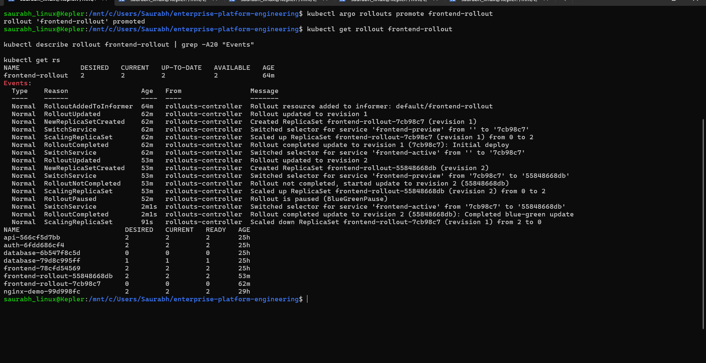

*Argo Rollouts successfully promoted the validated application version from the preview environment to production. Traffic was switched from the stable ReplicaSet to the new ReplicaSet, and the previous version was automatically scaled down. This demonstrates a production-grade Blue-Green deployment strategy with controlled approval, zero downtime, and safe release management.*

### Canary Deployment Initialization

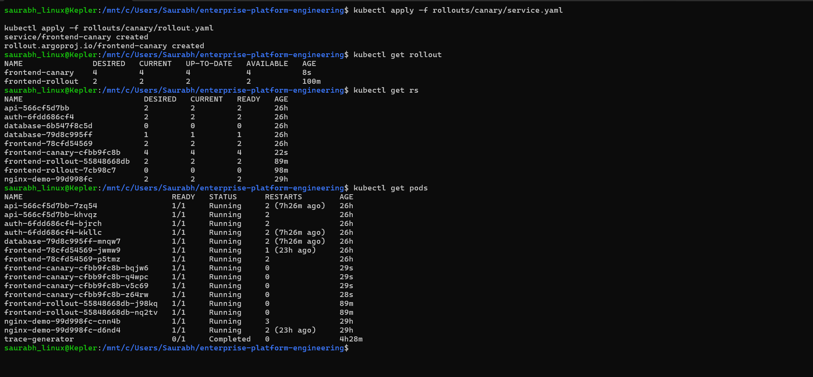

*Argo Rollouts deployed a canary-enabled frontend application with four replicas. The rollout controller manages progressive traffic shifting and staged promotion of new versions, enabling safer production releases compared to standard Kubernetes rolling updates.*

## Canary Deployment with Argo Rollouts

Argo Rollouts was implemented to enable progressive delivery and reduce deployment risk.

The rollout strategy gradually shifted traffic to a new application version before promoting it to production.

### Canary Rollout Result

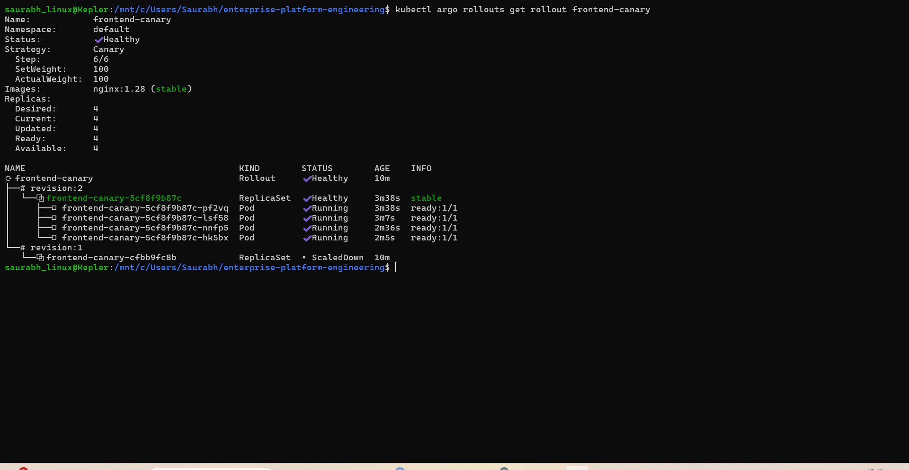

Key capabilities demonstrated:

- Progressive traffic shifting
- Controlled release promotion
- Automatic ReplicaSet management
- Safe production deployments
- Rollback-ready deployment strategy

The rollout successfully promoted nginx:1.28 to stable after completing all canary stages and automatically scaled down the previous ReplicaSet.

## Runtime Security with Falco

Falco was deployed as a DaemonSet across all Kubernetes nodes to provide runtime threat detection.

During deployment, Kyverno blocked the Falco installation because required CPU and memory requests/limits were missing. The Helm chart values were updated to comply with cluster governance policies before the deployment was approved.

### Falco Deployment

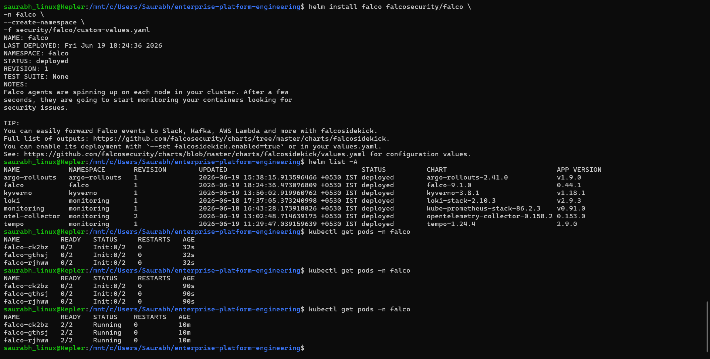

Capabilities:

- Runtime security monitoring
- Kubernetes audit event monitoring
- Container activity detection
- Policy-driven deployment enforcement through Kyverno
- Cluster-wide security visibility

## Runtime Security with Falco

Falco was deployed as a DaemonSet across all Kubernetes nodes to provide runtime threat detection.

A test workload was created and a sensitive file access operation was executed inside the container.

### Runtime Threat Detection

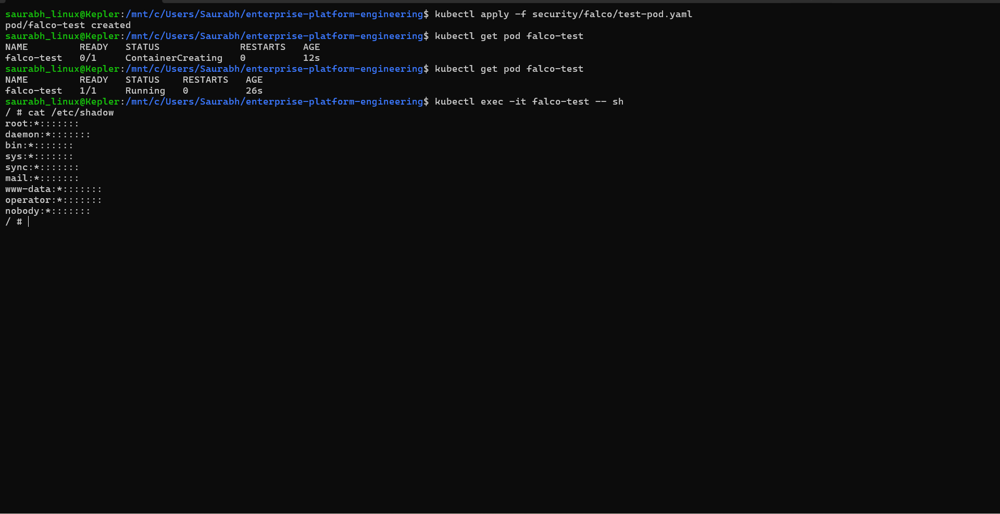

### Sensitive File Access Simulation


Falco successfully detected:

- Interactive shell execution inside containers
- Access to sensitive system files
- Suspicious runtime activity

This demonstrates runtime security monitoring beyond static image scanning and policy enforcement.

## 🚨 Incident Detection & Alerting

The platform continuously monitors Kubernetes workloads using Prometheus. When a pod enters a `CrashLoopBackOff` state, a custom alert rule is triggered and Alertmanager automatically sends a Slack notification to the operations team.

### Features

- Real-time CrashLoopBackOff detection
- Custom Prometheus alert rules
- Alertmanager integration
- Slack notifications with runbook links
- Automatic resolved notifications

### Workflow

```text
Kubernetes → Prometheus → Alertmanager → Slack
```

### Demo

| Prometheus Alert | Slack Notification |
|------------------|--------------------|
| 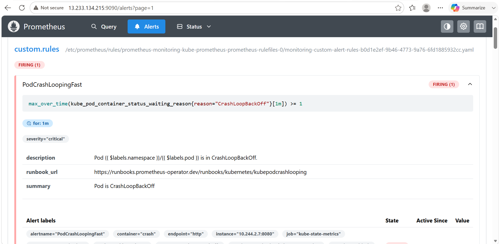 | 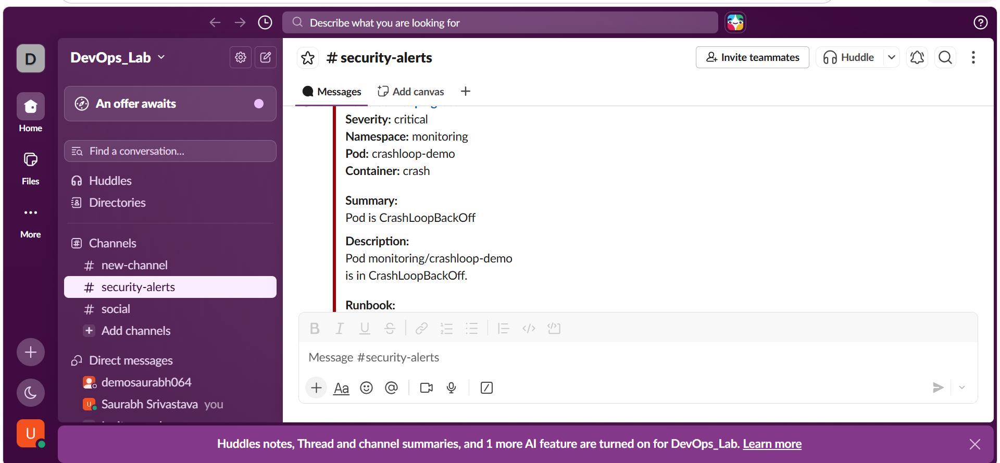 |
