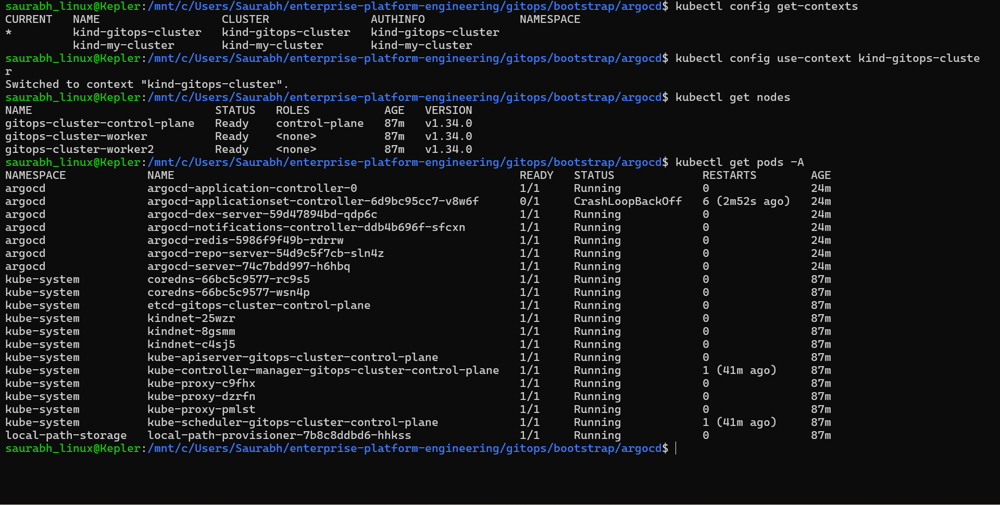
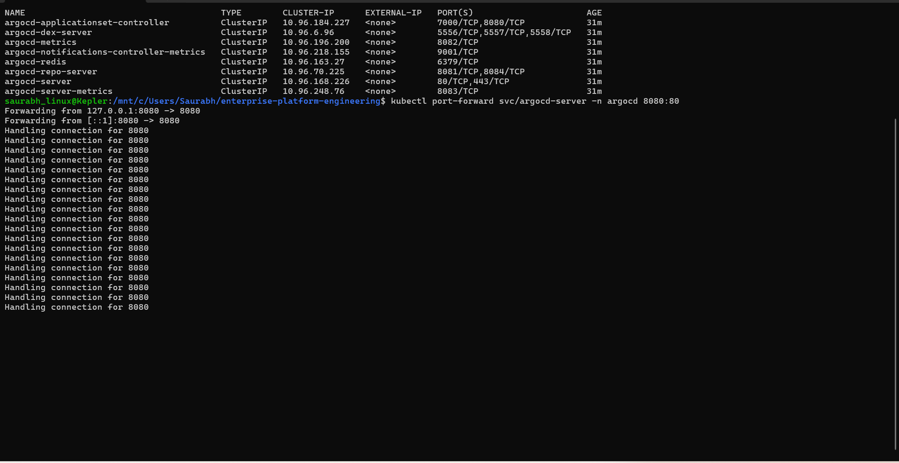

# Enterprise Platform Engineering

Production-grade Platform Engineering stack implementing GitOps, observability, security policies, progressive delivery, and incident-ready operations on Kubernetes.
### Kind Cluster Verification

*Fresh Kubernetes cluster showing only core system components before platform bootstrap, ensuring a clean and reproducible GitOps setup.*

### ArgoCD Bootstrap

*Successfully deployed ArgoCD as the GitOps control plane. Verified that all core components—including the API server, application controller, repository server, Redis, Dex, notifications controller, and ApplicationSet controller—are running and healthy.*